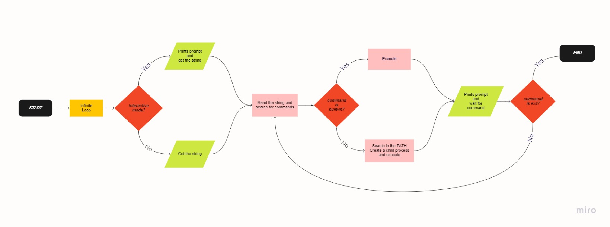

# _0x16. C - Simple Shell_
#### Simple shell is a program that tries to emulate the basic behavior of the original Shell.

## _Installation and compilation_
**1.** Open the terminal\
**2.** git clone https://github.com/ch-ov/simple_shell \
**3.** cd simple_shell\
**4.** gcc -Wall -Werror -Wextra -pedantic -std=gnu89 *.c -o hsh\
## _Usage_
#### In interactive mode:
```C
$ ./hsh
shell$ /bin/ls
hsh main.c shell.c
shell$
shell$ exit
$
```
#### In non-interactive mode:
```C
$ echo "/bin/ls" | ./hsh
hsh main.c shell.c test_ls_2
$
$ cat test_ls_2
/bin/ls
/bin/ls
$
$ cat test_ls_2 | ./hsh
hsh main.c shell.c test_ls_2
hsh main.c shell.c test_ls_2
$
```
## _Contributors_
    Christian Oviedo
    Johanna Rodriguez
## _License_
#### Free
